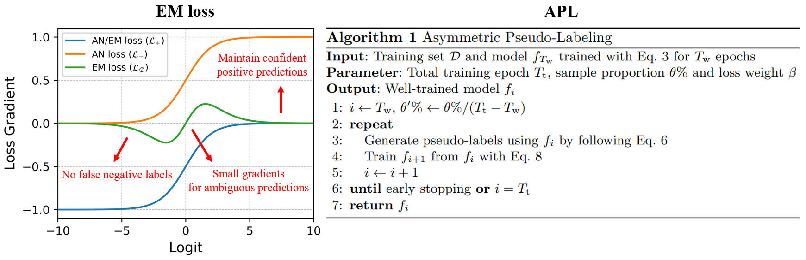
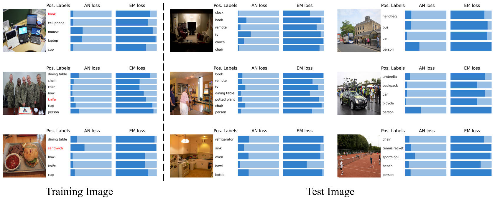

# [ECCV2022] Acknowledging the Unknown for Multi-label Learning with Single Positive Labels


> **Authors**: Donghao Zhou, Pengfei Chen, Qiong Wang, Guangyong Chen, Pheng-Ann Heng
>
> **Affiliations**: SIAT-CAS, UCAS, Tencent, Zhejiang Lab, CUHK

**Abstract**

Due to the difficulty of collecting exhaustive multi-label annotations, multi-label datasets often contain partial labels. We consider an extreme of this weakly supervised learning problem, called single positive multi-label learning (SPML), where each multi-label training image has only one positive label. Traditionally, all unannotated labels are assumed as negative labels in SPML, which introduces false negative labels and causes model training to be dominated by assumed negative labels. In this work, we choose to treat all unannotated labels from an alternative perspective, i.e. acknowledging they are unknown. Hence, we propose entropy-maximization (EM) loss to attain a special gradient regime for providing proper supervision signals. Moreover, we propose asymmetric pseudo-labeling (APL), which adopts asymmetric-tolerance strategies and a self-paced procedure, to cooperate with EM loss and then provide more precise supervision. Experiments show that our method significantly improves performance and achieves state-of-the-art results on all four benchmarks.

<div align="center">

</div>
<div align="center">

</div>


## 🛠️ Installation
1. Create a Conda environment for the code:
```
conda create --name SPML python=3.8.8
```
2. Activate the environment:
```
conda activate SPML
```
3. Install the dependencies:
```
pip install -r requirements.txt
```

## 💽 Preparing Datasets
### Downloading Data
#### PASCAL VOC

1. Run the following commands:

```
cd {PATH-TO-THIS-CODE}/data/pascal
curl http://host.robots.ox.ac.uk/pascal/VOC/voc2012/VOCtrainval_11-May-2012.tar --output pascal_raw.tar
tar -xf pascal_raw.tar
rm pascal_raw.tar
```

#### MS-COCO

1. Run the following commands:

```
cd {PATH-TO-THIS-CODE}/data/coco
curl http://images.cocodataset.org/annotations/annotations_trainval2014.zip --output coco_annotations.zip
curl http://images.cocodataset.org/zips/train2014.zip --output coco_train_raw.zip
curl http://images.cocodataset.org/zips/val2014.zip --output coco_val_raw.zip
unzip -q coco_annotations.zip
unzip -q coco_train_raw.zip
unzip -q coco_val_raw.zip
rm coco_annotations.zip
rm coco_train_raw.zip
rm coco_val_raw.zip
```

#### NUS-WIDE

1.  Follow the instructions in [this website](https://lms.comp.nus.edu.sg/wp-content/uploads/2019/research/nuswide/NUS-WIDE.html) to download the raw images of NUS-WIDE named `Flickr.zip`.
2.  Run the following commands:
```
mv {PATH-TO-DOWNLOAD-FILES}/Flickr.zip {PATH-TO-THIS-CODE}/data/nuswide
unzip -q Flickr.zip
rm Flickr.zip
```

> ❗*Instead of re-crawling the images of the NUS-WIDE dataset as done in [this paper](https://arxiv.org/abs/2106.09708), we download and use the official version of the NUS-WIDE dataset in our experiments.*

#### CUB

1.  Download `CUB_200_2011.tgz` in [this website](https://data.caltech.edu/records/20098).
2.  Run the following commands:
```
mv {PATH-TO-DOWNLOAD-FILES}/CUB_200_2011.tgz {PATH-TO-THIS-CODE}/data/cub
tar -xf CUB_200_2011.tgz
rm CUB_200_2011.tgz
```

### Formatting Data
For PASCAL VOC, MS-COCO, and CUB, use Python code to format data:
```
cd {PATH-TO-THIS-CODE}
python preproc/format_pascal.py
python preproc/format_coco.py
python preproc/format_cub.py
```
For NUS-WIDE, please download the formatted files [here](https://drive.google.com/drive/folders/1YL7WhnGpd-pjbtPL5r6IKiPeYFVdpYne?usp=sharing) and move them to the corresponding path:
```
mv {PATH-TO-DOWNLOAD-FILES}/{DOWNLOAD-FILES} {PATH-TO-THIS-CODE}/data/nuswide
```
`{DOWNLOAD-FILES}` should be replaced by `formatted_train_images.npy`, `formatted_train_labels.npy`, `formatted_val_images.npy`, or `formatted_train_labels.npy`.

### Generating Single Positive Annotations
In the last step, run `generate_observed_labels.py` to yield single positive annotations from full annotations of each dataset:
```
python preproc/generate_observed_labels.py --dataset {DATASET}
```
`{DATASET}` should be replaced by `pascal`, `coco`, `nuswide`, or `cub`.

## 🔬 Training and Evaluation
Run `main.py` to train and evaluate a model:
```
python main.py -d {DATASET} -l {LOSS} -g {GPU} -s {PYTORCH-SEED}
```
Command-line arguments are as follows:
1. `{DATASET}`: The adopted dataset. (*default*: `pascal` | *available*: `pascal`, `coco`, `nuswide`, or `cub`)
2. `{LOSS}`: The method used for training. (*default*: `EM_APL` | *available*: `bce`, `iun`, `an`, `EM`, or `EM_APL`)
3. `{GPU}`: The GPU index. (*default*: `0`)
4. `{PYTORCH-SEED}`: The seed of PyTorch. (*default*: `0`)

For example, to train and evaluate a model on the PASCAL VOC dataset using our EM loss+APL, please run:
```
python main.py -d pascal -l EM_APL
```

## 📑 Citation
If you find some useful insights from our work or our code is helpful in your research, please consider citing our paper:
```latex
@misc{zhou2022acknowledging,
      title={Acknowledging the Unknown for Multi-label Learning with Single Positive Labels},
      author={Donghao Zhou and Pengfei Chen and Qiong Wang and Guangyong Chen and Pheng-Ann Heng},
      year={2022},
      eprint={2203.16219},
      archivePrefix={arXiv},
      primaryClass={cs.CV}
}
```

## ✉️ Contact
Feel free to contact me (Donghao Zhou: [dh.zhou@siat.ac.cn](mailto:dh.zhou@siat.ac.cn)) if anything is unclear.

## 🤝 Acknowledgement
Our code is built upon the repository of [single-positive-multi-label](https://github.com/elijahcole/single-positive-multi-label). We would like to thank its authors for their excellent work.
